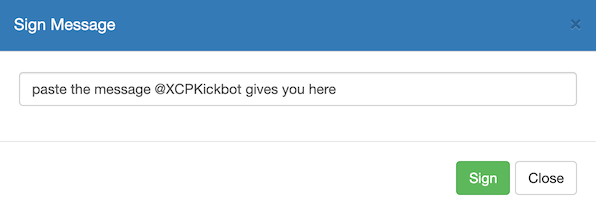

# The Salon ✂️

## *The Finest Salon in the Metaverse!*

### How to join The Salon

If you don't have it already, you'll need to install [Telegram Messenger](https://telegram.org/) and create an account

#### The Front Door 🚪

[The Front Door](https://t.me/HAIRPEPE) is a telegram room where you will validate that you hold at least 1 [HAIRPEPE](https://pepe.wtf/asset/HAIRPEPE)

* Join the channel using the link above. After you join you'll see a message from `@XCPKickBot` asking you to verify your ownership of a `HAIRPEPE`
* Start a DM with the bot and send a message with the command `/start`. The bot will ask you to provide your Counterparty / Rare Pepe Wallet Address
* DM the bot your address. The bot will ask you to sign a message with your wallet to prove that you own this address
* Use the Sign Message feature in Rare Pepe Wallet, Freewallet or Counterwallet to sign the message (see below for more details)
* That's it! If you've sucessfully signed and you hold a `HAIRPEPE` you're good to go. If something went wrong, then the bot might get angry..
* DM `@ShawnLeary` to get the invite link to The Salon

---

### Message Signing

#### Message Signing with Rare Pepe Wallet
Rare Pepe Wallet has a Sign Message feature which can be accessed from the ⚙️ menu in the upper right

Paste the message that `@XCPKickbot` gives you and click `Sign`

Copy the signature, and paste this back into your DM chat with `@XCPKickbot`

---

#### Message Signing with FreeWallet

FreeWallet has a Sign Message feature which can be accessed from the actions menu

Paste the message that `@XCPKickbot` gitves you and click `Sign Message`

Copy the signature, and paste this back into your DM chat with `@XCPKickbot`

---

  [`edit me on github`](https://github.com/windsok/thesalon)
